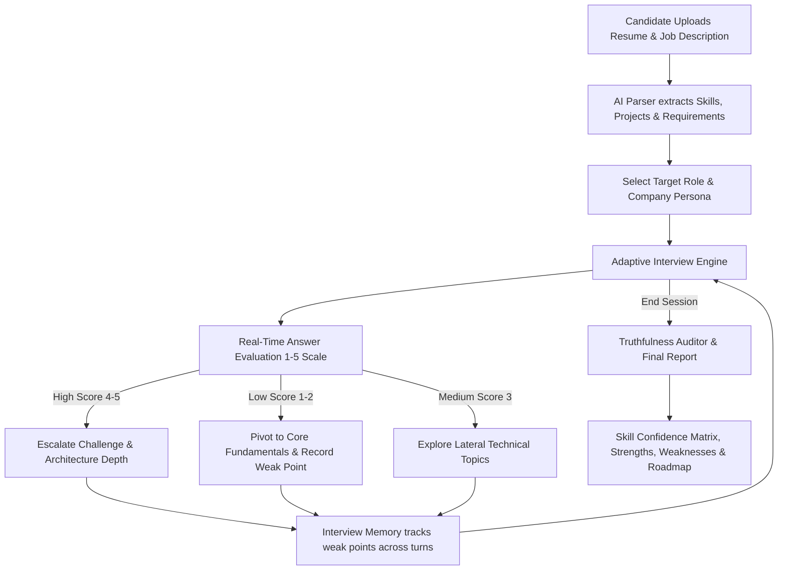

# InterviewIQ

Adaptive AI Technical Interview Platform with Resume Deep-Dives and Job Description Cross-Examination.

---

## Overview

InterviewIQ is an adaptive technical interview platform. Unlike static question banks, InterviewIQ ingests candidate resumes and target job descriptions (JDs), deep-dives real-world projects, dynamically adjusts question difficulty based on live responses, and audits claimed competencies against demonstrated answers.



---

## Core Capabilities

### 1. Dual Document Ingestion: Resume + Job Description (JD)
- **Resume Parsing**: PDF upload with automated extraction of technical projects, architecture summaries, and claimed skill tags.
- **Job Description Parsing**: Supports both PDF upload and raw text paste. Extracts target role title, mandatory tech stack, experience levels, and core responsibilities.
- **Cross-Examination Engine**: When both documents are present, the interview questions specifically target the intersection of the candidate's actual projects and the job description's critical requirements.
- **Document Management**: Dedicated removal/replacement controls for both Resume and Job Description.

### 2. Company Personas & Adaptive Difficulty
- **Google Persona**: Data structures, algorithmic complexity (Big-O), system trade-offs, and edge cases.
- **Amazon Persona**: Scalable architecture and Amazon Leadership Principles evaluated via the STAR method.
- **Startup Persona**: Velocity, system trade-offs, production debugging, and technology stack mastery.
- **General Persona**: Balanced CS fundamentals, full-stack design patterns, and code architecture.
- **Dynamic Difficulty**: Real-time evaluation (1–5 scale) adjusts upcoming questions between Easy, Medium, and Hard tiers.
- **Interview Memory**: Automatically tracks topics where the candidate scored $\le 2$ and circles back in later turns to re-evaluate comprehension.

### 3. Resume Truthfulness Auditor & Final Report
- **Truthfulness Rating**: Cross-examines claimed skills against direct transcript answers with per-skill confidence ratings (1–5) and concrete evidence quotes.
- **Strengths & Weaknesses**: Highlights the top 3 demonstrated technical strengths and top 3 areas for growth.
- **Prioritized Roadmap**: Actionable, prioritized steps (High, Medium, Low) for interview preparation.
- **Performance Analytics**: Session history with score trend visualizations across past interviews.

### 4. Multimodal Voice & Keyboard Interaction
- **Dual Voice Architecture**: Browser-native Web Speech API (STT/TTS) with automatic server-side fallback transcription for restricted environments (such as Brave or privacy-hardened browsers).
- **Keyboard Ergonomics**: `Enter` submits answers instantly, `Shift + Enter` inserts newlines, and `Spacebar` toggles recording in voice mode.

---

## Tech Stack

| Layer | Technologies |
|---|---|
| Frontend | React 19, Vite, React Router 7 |
| Styling & Theme | Custom token-based design system, CSS custom properties (Dark / Light mode) |
| Backend | Node.js, Express 5 |
| Database | MongoDB via Mongoose (with local JSON/in-memory persistence fallback) |
| Authentication | JWT (JSON Web Tokens) with `bcryptjs` password hashing |
| AI Integration | Groq (primary LLM provider) with Google Gemini automatic fallback |
| Parsing & Voice | `multer`, `pdf-parse`, Web Speech API, Server audio transcription |
| Testing | Vitest, Supertest, React Testing Library |

---

## Project Structure

```
InterviewIQ/
├── client/                     React + Vite Frontend
│   ├── src/
│   │   ├── components/         Logo, ThemeToggle, ScoreTrendChart, SessionHistoryList, Icon
│   │   ├── context/            AuthContext, ThemeContext
│   │   ├── hooks/              useSpeech (STT/TTS with server fallback)
│   │   ├── pages/              Login, Register, Dashboard, ResumeUpload, InterviewSession, FinalReport
│   │   ├── config/             API endpoint configuration
│   │   └── index.css           Token design system, themes, and layout rules
├── server/                     Express 5 Backend
│   ├── src/
│   │   ├── models/             User, Resume, JobDescription, Session
│   │   ├── routes/             auth, resume, jd, session, speech
│   │   ├── services/           aiProvider, gemini, adaptiveEngine, report
│   │   ├── middleware/         auth
│   │   ├── app.js              Express configuration & SPA static catch-all
│   │   ├── db.js               MongoDB connection with JSON fallback store
│   │   └── server.js           Application entry point
├── test/                       Client and Server test suites
└── scripts/dev.js              Concurrent full-stack dev launcher
```

---

## Deployment Architecture

InterviewIQ is deployed as a single production service on **Render**:

1. **Unified Production Build**: The client application is compiled via `npm run build --workspace=client` into `client/dist`.
2. **SPA Serving & Express 5 Routing**: The Express backend statically serves `client/dist` and uses a fallback catch-all handler (`app.use((req, res) => res.sendFile(...))`) to route direct client URLs (such as `/dashboard` and `/resume`) to `index.html`.
3. **API Protection**: Explicit `/api` 404 handlers ensure API errors always return structured JSON rather than falling through to HTML pages.
4. **Free-Tier Keep-Alive**: An **UptimeRobot** monitor is configured to ping the application health endpoint every **5 minutes**. This prevents Render's free-tier instances from spinning down after 15 minutes of inactivity, ensuring instant response times for active users.

---

## Getting Started

### Prerequisites
- Node.js 18+
- npm (workspaces enabled)
- Groq API Key and/or Google Gemini API Key

### 1. Clone & Install

```bash
git clone https://github.com/AdityaKrishnamurthy/InterviewIQ.git
cd InterviewIQ
npm install
```

### 2. Configure Environment

Create a `.env.local` file in the root directory:

```env
PORT=5000
MONGO_URI=mongodb://localhost:27017/interviewiq
JWT_SECRET=your_jwt_secret_key_here
GROQ_API_KEY=your_groq_api_key
GEMINI_API_KEY=your_gemini_api_key

# Optional Model Overrides
# GROQ_MODEL=llama-3.3-70b-versatile
# GEMINI_MODEL=gemini-2.0-flash
```

### 3. Launch Development Server

```bash
npm run dev
```

- Frontend: `http://localhost:3000` (or `http://localhost:3002`)
- Backend: `http://localhost:5000`

---

## API Reference

### Authentication
| Method | Endpoint | Description | Auth |
|---|---|---|---|
| `POST` | `/api/auth/register` | Register a new account | No |
| `POST` | `/api/auth/login` | Authenticate user and return JWT | No |
| `GET` | `/api/auth/me` | Fetch authenticated user profile | Yes |

### Resume Management
| Method | Endpoint | Description | Auth |
|---|---|---|---|
| `POST` | `/api/resume/upload` | Upload & parse resume PDF via Multer | Yes |
| `GET` | `/api/resume/latest` | Retrieve current user's active resume | Yes |
| `DELETE` | `/api/resume/latest` | Remove current user's active resume | Yes |

### Job Description (JD) Management
| Method | Endpoint | Description | Auth |
|---|---|---|---|
| `POST` | `/api/jd/upload` | Upload JD via PDF or JSON raw text | Yes |
| `GET` | `/api/jd/latest` | Retrieve current user's active JD | Yes |
| `DELETE` | `/api/jd/latest` | Remove current user's active JD | Yes |

### Interview Session Lifecycle
| Method | Endpoint | Description | Auth |
|---|---|---|---|
| `GET` | `/api/session/personas` | Retrieve available interviewer personas | No |
| `POST` | `/api/session/start` | Start session using active Resume + JD context | Yes |
| `POST` | `/api/session/answer` | Submit answer; get evaluation & adaptive follow-up | Yes |
| `POST` | `/api/session/:id/complete` | Complete session & generate Truthfulness Report | Yes |
| `GET` | `/api/session/:id/report` | Retrieve final evaluation report | Yes |
| `GET` | `/api/session/history` | Retrieve past session history and score metrics | Yes |
| `DELETE` | `/api/session/:id` | Delete a specific interview session | Yes |

### Speech & Audio
| Method | Endpoint | Description | Auth |
|---|---|---|---|
| `POST` | `/api/speech/transcribe` | Fallback server-side audio transcription | Yes |

---

## Test Suites

The test suites cover unit logic, adaptive algorithms, authentication flows, and component interactions:

```bash
# Run both test suites
npm test

# Run backend tests only
npm run test:server

# Run frontend tests only
npm run test:client
```

---

## License

MIT License. Designed and engineered for technical interview preparation.
